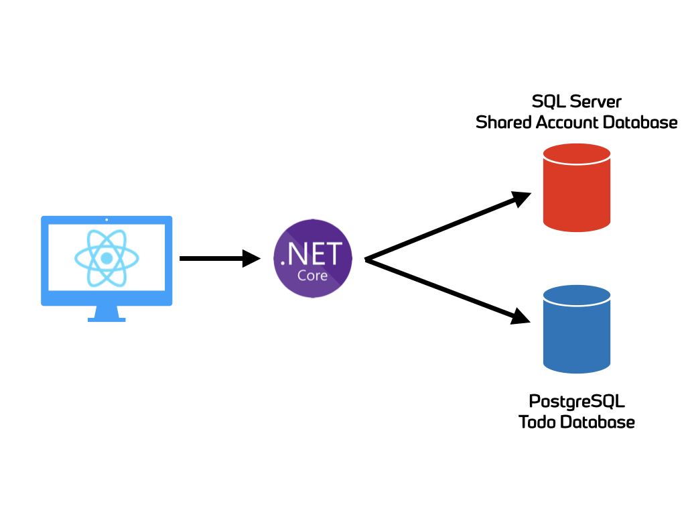

# Spawn demo app

This app showcases a semi complex application that takes advantage of [Spawn](https://spawn.cc/) to simplify development.

## Architecture

The application is a simple "Todo" application. It's architecture is as follows:

* C# ASP.NET Core WebAPI
* ReactJS Frontend
* Microsoft SQL Server database (for "account" information)
* PostgreSQL database (for "todo" item information)

## Running in Gitpod

Click the badge below to open this repository in Gitpod with all of the dependencies installed and ready to go.

## Running this locally

To get up and running with this application, perform the following:

1) Clone the repository
2) Open it up in VS Code
3) Hit F5

This will:

* Provision two [Spawn data containers](https://spawn.cc/docs/concepts-data-container). One for the Todo database and another for the Account database.
* Start the API server with the configuration returned from Spawn to connect to the databases.
* Start the Frontend

NOTE: Running the application this way assumes that the spawn data images already exist. If they do not, you must create them.

The spawn data image names are configured in the [.env](.env) file. You can change these if necessary.

### Subsequent restarts

Subsequent restarts (F5) will **reuse the spawn data containers**. That means any modification to the database between restarts calls will **persist**.

If you want to get _fresh_ containers, [then you can delete the Spawn data containers](https://spawn.cc/docs/spawnctl-dc-delete) and the startup script will reprovision them.
